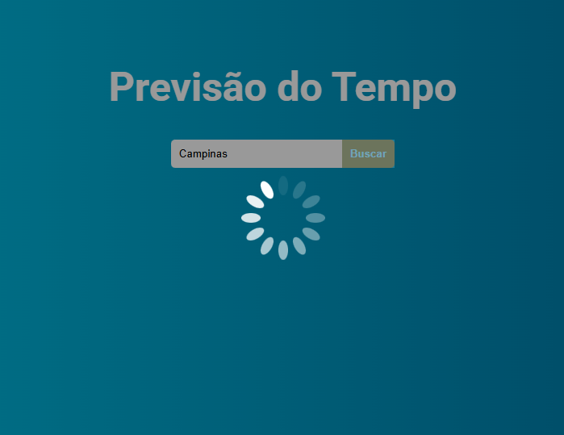
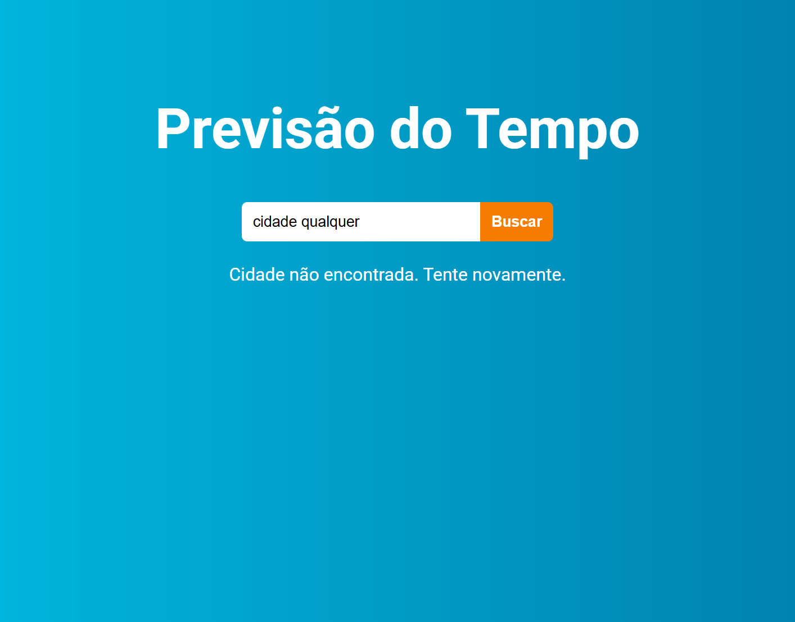
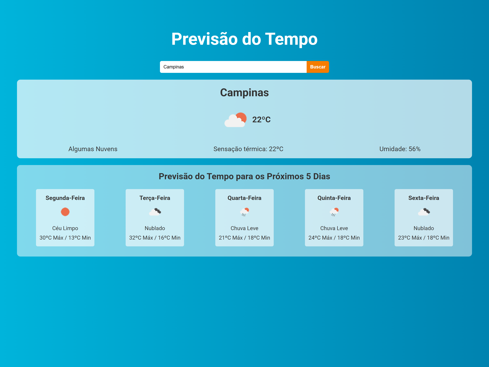
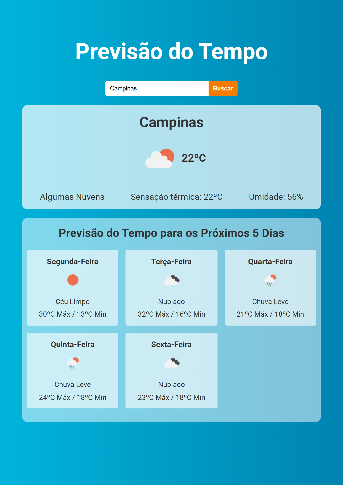
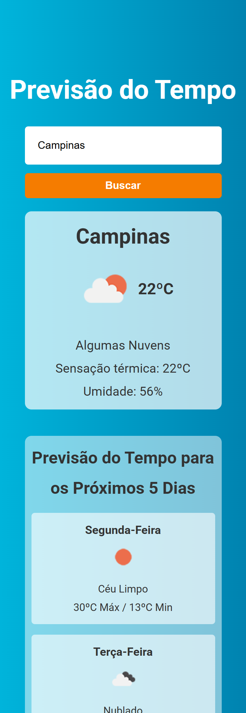

# Projeto de Previsão do Tempo — Versão Refatorada

Este repositório apresenta a **versão refatorada** do projeto de previsão do tempo originalmente desenvolvido com base em um tutorial do canal **DevClub**.

O objetivo desta nova versão foi **aprofundar o aprendizado** em React, aprimorar a **estrutura do código** e implementar boas práticas de **arquitetura**, **experiência do usuário** (UX) e **organização de componentes**.

---

## 🔄 Principais Melhorias em Relação à Versão Original

- **Lógica aprimorada**: agora o aplicativo calcula e exibe corretamente as **temperaturas mínimas e máximas** de cada dia, em vez de mostrar apenas um horário isolado.

- **Reestruturação em POO**: criação de uma classe `Api` com métodos responsáveis por lidar com as requisições, tornando o código mais modular e fácil de manter.

- **Separação de responsabilidades**: extração de funções auxiliares e limpeza do JSX, melhorando a legibilidade e organização dos componentes.

- **Responsividade**: o layout foi ajustado para se adaptar a diferentes tamanhos de tela, garantindo uma boa visualização tanto em **desktop** quanto em **dispositivos móveis**.

- **Feedback visual de carregamento**: implementação de um componente <Loading /> com animação, exibido enquanto os dados da API são carregados.

- **Tratamento de erros**: exibição de mensagem amigável na interface quando a cidade não é encontrada.

- **Código mais previsível e limpo**: uso de async/await com try/catch/finally, garantindo que o estado de loading e erros sejam tratados de forma consistente.

---

## 🛠️ Tecnologias Utilizadas

- **React.js**
- **Axios**
- **JavaScript (ES6+)**
- **CSS Responsivo**
- **API OpenWeatherMap**

---

## 💡 Objetivo do Projeto

Consolidar conceitos aprendidos em React, como:

- Uso de **hooks** (`useState`, `useRef`);
- **Comunicação com APIs externas** e tratamento de erros;;
- **Refatoração de código** e **reutilização de componentes**;
- Aplicação de **boas práticas de arquitetura** e **POO** no front-end.
- Melhoria contínua da **experiência do usuário (UX)**.

---

## 🔗 Repositório Original e Site ao Vivo

Você pode conferir o site ao vivo em:
[Lik do site ao vivo](https://weather-app-react-eight-mu.vercel.app)

A versão inicial do projeto (baseada no tutorial) está disponível em:  
👉 [Link para o repositório original](https://github.com/biarmortari/weather-app-tutorial)

---

## 🖼️ Confira os prints do site

### 💫 Estados do aplicativo

| Tela de carregamento                            | Tela de erro                         |
| ----------------------------------------------- | ------------------------------------ |
|  |  |

### 💻 Layouts responsivos

| Desktop                              | Tablet                             | Mobile                             |
| ------------------------------------ | ---------------------------------- | ---------------------------------- |
|  |  |  |
